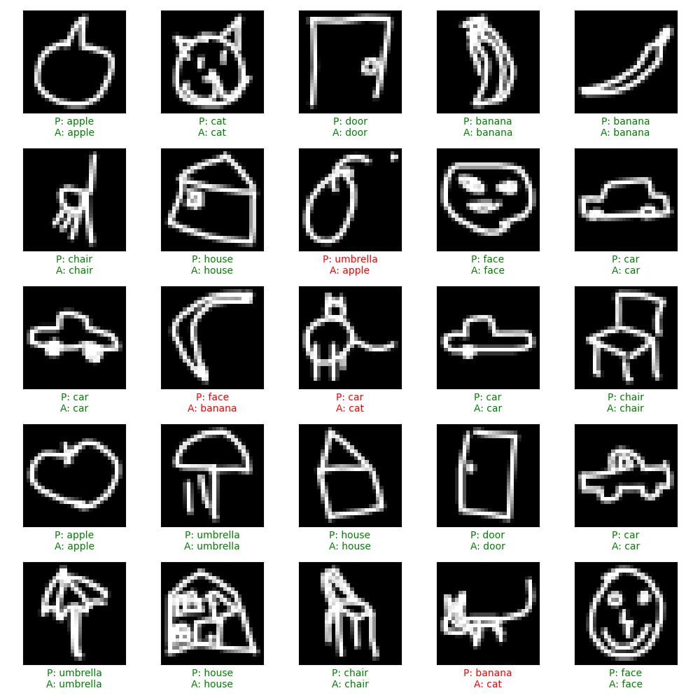

# AI-Powered Doodle Classifier

![Doodle Classifier Demo]


A machine learning application that recognizes hand-drawn doodles in real-time using TensorFlow and Google's QuickDraw dataset. This project includes a model trainer and an interactive web interface for testing.

## Features

- 🎨 Real-time doodle recognition with confidence scores
- 🧠 Convolutional Neural Network trained on the QuickDraw dataset
- 🖌️ Interactive drawing canvas for testing the model
- 📊 Visualizations of training results and predictions
- 💻 Works on Mac, Windows and Linux (with appropriate setup)

## Categories

The model is trained to recognize 10 different categories of doodles:

- Apple
- Banana
- Car
- Cat
- Chair
- Door
- Face
- House
- Star
- Umbrella

## Demo

![Prediction Example]

## Setup and Installation

### Prerequisites

- Python 3.9 or 3.10 (TensorFlow has issues with Python 3.11+ as of 2025)
- pip for package installation
- Web browser for the interactive interface

### Installation

1. Clone the repository:

   ```bash
   git clone https://github.com/Yashasrn33/doodle_classifier.git
   cd doodle_classifier
   ```

2. Create a virtual environment:

   ```bash
   python -m venv venv
   source venv/bin/activate  # On Windows: venv\Scripts\activate
   ```

3. Install dependencies:
   ```bash
   pip install -r requirements.txt
   ```

### Mac-specific setup (for Apple Silicon)

If you're using a Mac with Apple Silicon (M1/M2/M3):

```bash
pip install tensorflow-macos
pip install tensorflow-metal  # Optional, for GPU acceleration
```

## Usage

### 1. Train the Model

First, you need to train the model or download a pre-trained model:

```bash
python trainer.py
```

This will:

- Download sample data from Google's QuickDraw dataset
- Train a CNN model to recognize doodles
- Save the trained model as `doodle_classifier.h5`
- Generate visualizations of the training process

### 2. Run the Web Interface

After training the model, start the web interface:

```bash
python app.py
```

Then open your browser to http://127.0.0.1:5000

### 3. Draw and Classify

- Draw in the black canvas using your mouse or touch screen
- Click "Classify" to see what the AI thinks you've drawn
- View confidence scores for the top predictions
- Use "Clear" to start over

## Architecture

The doodle classifier uses a Convolutional Neural Network (CNN) architecture:

```
Input (28x28x1) → Conv2D → MaxPool → Conv2D → MaxPool → Flatten → Dense → Dropout → Output (10 classes)
```

## Customization

### Adding more categories

To add more categories, modify the `CATEGORIES` list in both `trainer.py` and `app.py`:

```python
CATEGORIES = ['apple', 'banana', 'car', 'cat', 'chair',
              'door', 'face', 'house', 'star', 'umbrella',
              'new_category1', 'new_category2']  # Add new categories here
```

Then retrain the model with `python trainer.py`.

### Improving model performance

For better performance:

1. Increase the number of training samples:

   ```python
   subset_size = 5000  # Change from default 1000
   ```

2. Use a more complex model by adding more layers:

   ```python
   model = models.Sequential([
       # Add more layers or increase filters
       layers.Conv2D(32, (3, 3), activation='relu', input_shape=(IMAGE_SIZE, IMAGE_SIZE, 1)),
       # ...
   ])
   ```

3. Train for more epochs:
   ```python
   EPOCHS = 10  # Change from default 5
   ```

## Project Structure

```
doodle-classifier/
├── trainer.py           # Script for downloading data and training the model
├── app.py               # Flask web application for the interactive interface
├── doodle_classifier.h5 # Trained model (generated by trainer.py)
├── templates/           # HTML templates for the web interface
│   └── index.html
├── training_history.png # Visualization of training metrics (generated)
├── prediction_examples.png # Examples of model predictions (generated)
├── requirements.txt     # Package dependencies
└── README.md            # This file
```

## Technologies Used

- TensorFlow/Keras for model architecture and training
- Flask for the web server
- HTML5 Canvas for the drawing interface
- NumPy for numerical operations
- Matplotlib for visualizations

## Dataset

This project uses the [Google QuickDraw Dataset](https://github.com/googlecreativelab/quickdraw-dataset), which contains millions of drawings across 345 categories.

## Future Improvements

- [ ] Add more categories for recognition
- [ ] Implement data augmentation for better generalization
- [ ] Create a mobile app version
- [ ] Add ability to save and share drawings
- [ ] Implement a gallery of classified images

## License

This project is licensed under the MIT License - see the LICENSE file for details.

## Acknowledgments

- Google Creative Lab for the QuickDraw dataset
- TensorFlow team for the machine learning framework
- The open-source community for various packages and tools

## Contributing

1. Fork the repository
2. Create a feature branch: `git checkout -b feature-name`
3. Commit your changes: `git commit -m 'Add some feature'`
4. Push to the branch: `git push origin feature-name`
5. Submit a pull request

---

Made with ❤️ and TensorFlow
